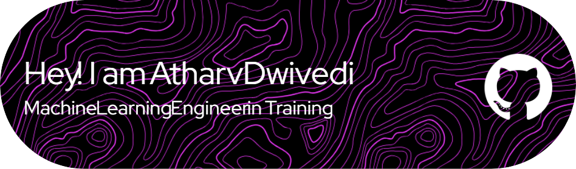

 
# 💫 About Me:
👋 Hi, I’m Atharv Sanjiv Dwivedi 👀 I’m interested in Computational Technologies, Economics(Macro/Micro Economics), the Fin-Tech industry(Finance-related topics and financial markets as well.) 🌱 I’m currently learning and working on multiple skills. I am learning Full-Stack Web Development and developing my interest in Data Science, Generative-AI, and Machine Learning. 📫 How to reach me:   Ping me on Linkedin: www.linkedin.com/in/atharv-dwivedi-01a292289 |  😄 Pronouns: He/His ⚡ Fun fact: I started my small-scale biz at 15, and sold it for 150k after 3 years.

## 🌐 Socials:
  

# 💻 Tech Stack:
                              
# 📊 GitHub Stats:
 
 

## 🏆 GitHub Trophies

 

 
  
<!--   <h2>🐍 Contributions 🐍</h2>
  

 -->

<h2 align="center">Leetcode Info 🖥 <h2>  

  
  
  
  

  
    

  
 

### ✍️ Random Dev Quote

<!-- Proudly created with GPRM ( https://gprm.itsvg.in ) -->
